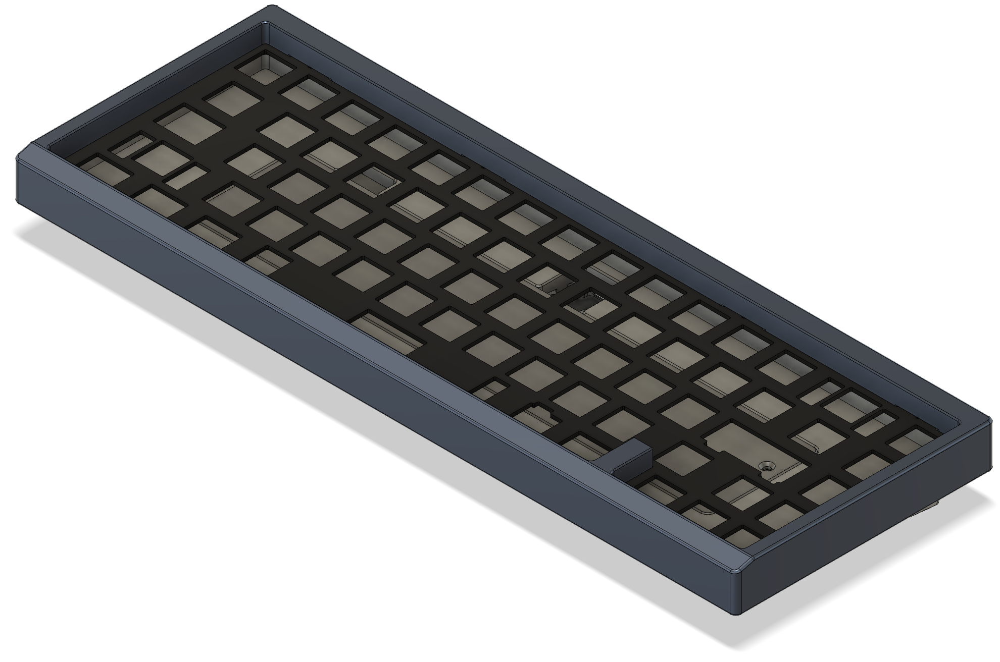
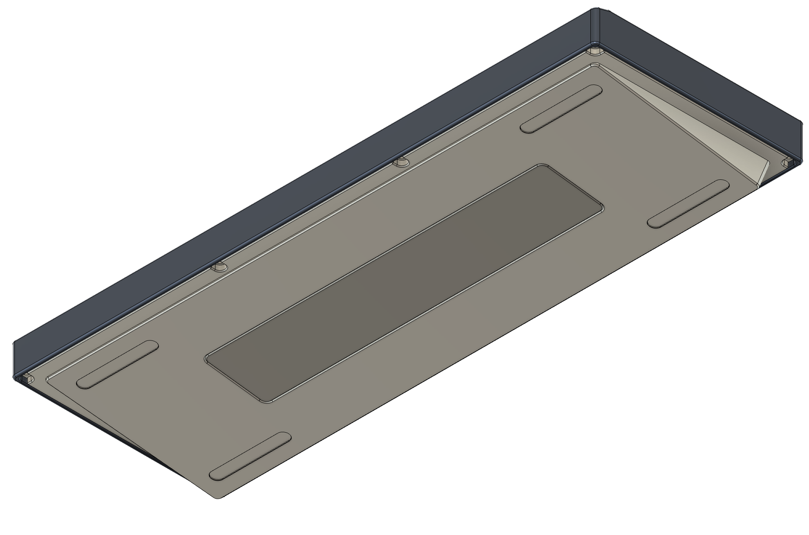

# genesis
a 65% keyboard that's a year in the making   
> 50% learning cad/keyboard design, 30% doing nothing, 20% actually making the keyboard
## features
* 7 deg angle
* top mount
* seamless
* arrow blocker
* weight
* support for a bakeneko65 pcb (untested but should work in theory)
## images

## hardware
|          |link      |
|----------|----------|
|case |[mcmaster](https://www.mcmaster.com/91292A012/)|
|plate/db|[mcmaster](https://www.mcmaster.com/91292A005/)|
|weight|[mcmaster](https://www.mcmaster.com/92125A082/)|
